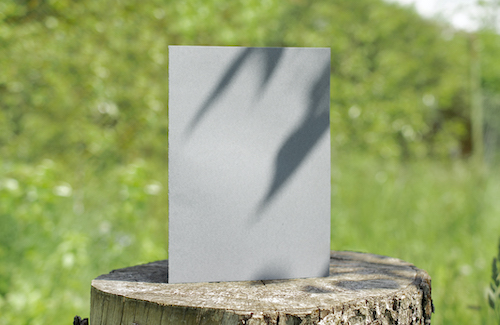

# Моя Картина

Описание моей картины: Это произведение искусства было создано с особой техникой и вдохновением.

<!-- Элемент, где будет отображаться стоимость -->

<strong>Текущая стоимость:</strong> 

<!-- Элемент для передачи данных в JavaScript через data-* атрибуты -->

